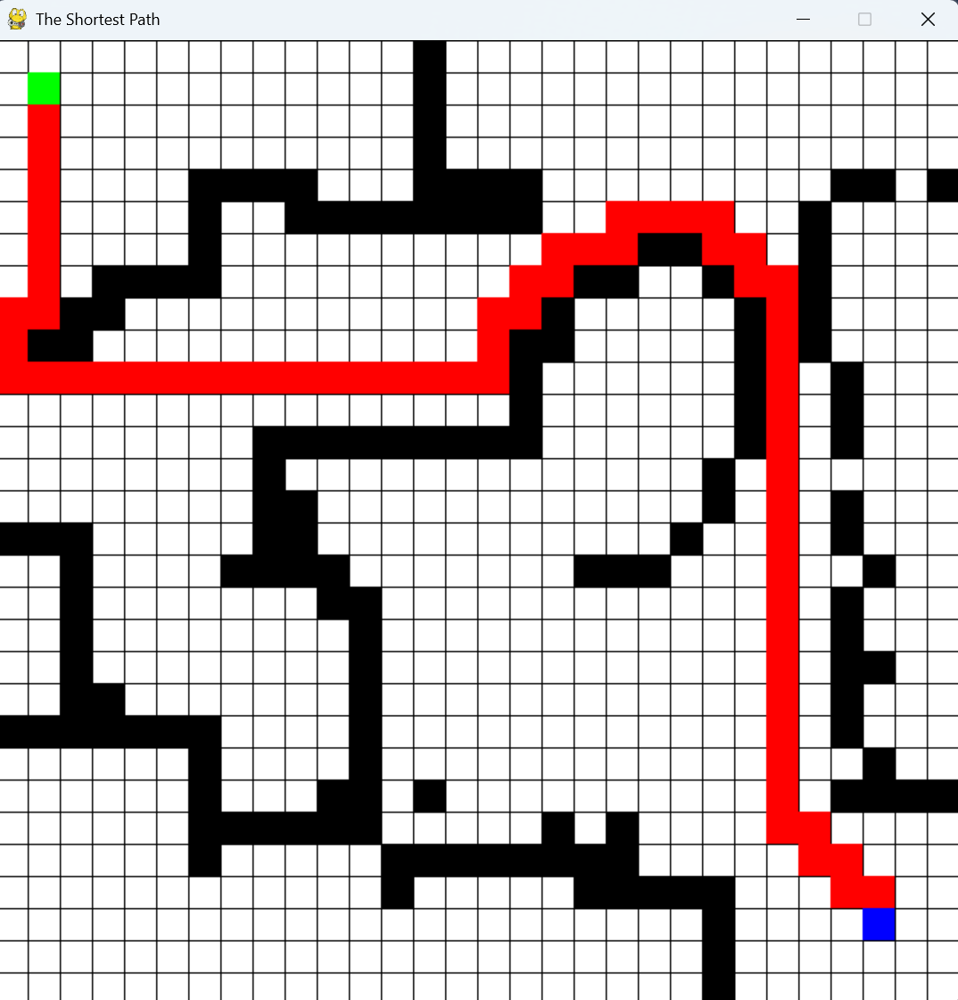

# A\* Pathfinding Visualizer

A simple Python/PyGame visualization of the A\* pathfinding algorithm.

This project was developed during my first year of university as an exploration of search algorithms and interactive algorithm visualization.

## Overview

The application allows users to create a grid, define start and end points, place obstacles, and visualize the shortest path found by the A\* algorithm.

It was built as a small educational project to better understand:

- graph search algorithms
- pathfinding heuristics
- grid-based navigation
- interactive visualization with PyGame

## Features

- Interactive grid-based pathfinding
- Custom grid dimensions
- User-defined start and end points
- Click-to-toggle obstacles
- A\* shortest path calculation
- Visual representation of the computed path
- Optional step-by-step visualization mode

## Tech Stack

- Python
- PyGame
- Tkinter

## Algorithm

The project implements the A\* search algorithm using:

- an open list for nodes to be evaluated
- a closed list for visited nodes
- movement cost calculation
- heuristic distance estimation
- path retracing from destination to origin

The heuristic uses diagonal-style distance weighting, commonly used in grid-based pathfinding.

## Motivation

This was an early university project created to explore how abstract search algorithms can be made easier to understand through visual feedback.

Although simple, it helped me build foundational knowledge in:

- algorithms
- data structures
- event-driven programming
- GUI interaction
- visual debugging

## Running the Project

Install dependencies:

```bash
pip install pygame
```

Run the application:

```bash
python main.py
```

## Screenshots


